# Diagramma di Flusso - Reset Password

## Diagramma Completo

```mermaid
flowchart TD
    Start([Utente richiede reset password]) --> InputEmail[Utente inserisce email]
    InputEmail --> ValidateClient{Validazione email<br/>lato client}
    
    ValidateClient -->|Email non valida| ErrorInvalid[Mostra errore:<br/>Email non valida]
    ErrorInvalid --> End1([STOP])
    
    ValidateClient -->|Email valida| CheckProfiles[RPC: check_email_exists_in_profiles<br/>Query: SELECT FROM profiles<br/>WHERE email = input_email]
    
    CheckProfiles --> CheckResult{Email trovata<br/>in profiles?}
    
    CheckResult -->|NO| ErrorNotFound[Mostra errore:<br/>Email non trovata]
    ErrorNotFound --> End2([STOP])
    
    CheckResult -->|SÌ| PrepareURL[Prepara redirectUrl<br/>per il link di reset]
    
    PrepareURL --> CallReset[supabase.auth.resetPasswordForEmail<br/>email, redirectTo]
    
    CallReset --> SupabaseCheck{Supabase controlla<br/>email in auth.users}
    
    SupabaseCheck -->|Email NON trovata<br/>in auth.users| SilentError[Errore silenzioso<br/>non mostrato all'utente]
    SilentError --> End3([STOP - Email non inviata])
    
    SupabaseCheck -->|Email trovata<br/>in auth.users| GenerateToken[Supabase genera token<br/>di reset scade in 1 ora]
    
    GenerateToken --> CreateLink[Crea link:<br/>redirectUrl?access_token=...<br/>&refresh_token=...&type=recovery]
    
    CreateLink --> SendEmail[Supabase invia email<br/>all'utente con link]
    
    SendEmail --> SuccessMsg[Mostra messaggio:<br/>Email inviata con successo!]
    SuccessMsg --> WaitEmail([Attesa click utente<br/>sul link email])
    
    WaitEmail --> UserClicks[Utente clicca link<br/>nell'email]
    
    UserClicks --> Navigate[Browser naviga a:<br/>/reset-password?access_token=...<br/>&refresh_token=...&type=recovery]
    
    Navigate --> ExtractToken[ResetPasswordPage<br/>estrae token dalla URL]
    
    ExtractToken --> VerifyType{Tipo = recovery?}
    
    VerifyType -->|NO| ErrorType[Errore:<br/>Link non valido]
    ErrorType --> Redirect1[Redirect a /auth?mode=login]
    Redirect1 --> End4([STOP])
    
    VerifyType -->|SÌ| SetSession[supabase.auth.setSession<br/>access_token, refresh_token]
    
    SetSession --> VerifyToken{Supabase verifica<br/>token}
    
    VerifyToken -->|Token scaduto<br/>o invalido| ErrorExpired[Errore:<br/>Link scaduto o non valido]
    ErrorExpired --> Redirect2[Redirect a /auth?mode=login]
    Redirect2 --> End5([STOP])
    
    VerifyToken -->|Token valido| CreateSession[Sessione autenticata<br/>creata]
    
    CreateSession --> ShowForm[Mostra form<br/>per nuova password]
    
    ShowForm --> InputPassword[Utente inserisce<br/>nuova password 2 volte]
    
    InputPassword --> ValidatePass{Validazione password:<br/>- Uguali?<br/>- Min 6 caratteri?}
    
    ValidatePass -->|NO| ErrorPass[Mostra errore<br/>validazione password]
    ErrorPass --> ShowForm
    
    ValidatePass -->|SÌ| UpdatePassword[supabase.auth.updateUser<br/>password: newPassword]
    
    UpdatePassword --> UpdateAuth{Supabase aggiorna<br/>encrypted_password<br/>in auth.users}
    
    UpdateAuth -->|Errore| ErrorUpdate[Mostra errore:<br/>Aggiornamento fallito]
    ErrorUpdate --> End6([STOP])
    
    UpdateAuth -->|Successo| SuccessUpdate[Password aggiornata<br/>con successo!]
    
    SuccessUpdate --> ShowSuccess[Mostra messaggio:<br/>Password aggiornata]
    
    ShowSuccess --> WaitRedirect[Attesa 3 secondi]
    
    WaitRedirect --> RedirectLogin[Redirect a<br/>/auth?mode=login]
    
    RedirectLogin --> End7([COMPLETATO])
    
    style Start fill:#e1f5ff
    style End1 fill:#ffcccc
    style End2 fill:#ffcccc
    style End3 fill:#ffcccc
    style End4 fill:#ffcccc
    style End5 fill:#ffcccc
    style End6 fill:#ffcccc
    style End7 fill:#ccffcc
    style CheckProfiles fill:#fff4e6
    style CallReset fill:#fff4e6
    style SetSession fill:#fff4e6
    style UpdatePassword fill:#fff4e6
    style SilentError fill:#ffcccc
```

## Diagramma Semplificato - Focus su Tabelle

```mermaid
flowchart LR
    subgraph "Fase 1: Controllo Email"
        A[Utente inserisce email] --> B[RPC: check_email_exists_in_profiles]
        B --> C{Query: profiles}
        C -->|Email trovata| D[Procedi]
        C -->|Email NON trovata| E[Errore: Email non trovata]
    end
    
    subgraph "Fase 2: Invio Email Reset"
        D --> F[supabase.auth.resetPasswordForEmail]
        F --> G{Query interna: auth.users}
        G -->|Email trovata| H[Genera token e invia email]
        G -->|Email NON trovata| I[Errore silenzioso]
    end
    
    subgraph "Fase 3: Reset Password"
        H --> J[Utente clicca link]
        J --> K[supabase.auth.setSession]
        K --> L[Utente inserisce nuova password]
        L --> M[supabase.auth.updateUser]
        M --> N{Update: auth.users<br/>encrypted_password}
        N --> O[Password aggiornata]
    end
    
    style C fill:#fff4e6
    style G fill:#fff4e6
    style N fill:#fff4e6
    style E fill:#ffcccc
    style I fill:#ffcccc
    style O fill:#ccffcc
```

## Tabella delle Operazioni Database

| Fase | Operazione | Tabella Usata | Tipo Query | Funzione |
|------|-----------|---------------|------------|----------|
| **1. Controllo preliminare** | `check_email_exists_in_profiles` | `profiles` | SELECT | RPC Function |
| **2. Invio email reset** | `resetPasswordForEmail` (interno) | `auth.users` | SELECT | Supabase Auth API |
| **3. Verifica token** | `setSession` (interno) | `auth.users` | SELECT/UPDATE | Supabase Auth API |
| **4. Aggiornamento password** | `updateUser` (interno) | `auth.users` | UPDATE | Supabase Auth API |

## Note Importanti

1. **Disallineamento critico**: Il controllo preliminare usa `profiles`, ma `resetPasswordForEmail` usa `auth.users`
2. **Errore silenzioso**: Se l'email non esiste in `auth.users`, l'errore potrebbe non essere mostrato
3. **Sincronizzazione**: Se un utente esiste in `auth.users` ma non in `profiles`, il reset viene bloccato erroneamente
4. **Token scadenza**: Il token di reset scade dopo 1 ora (default Supabase)

